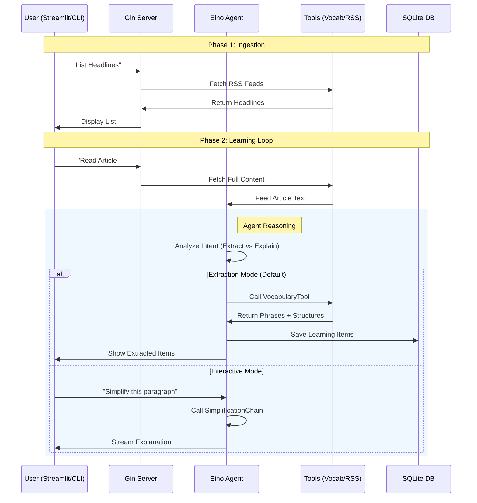

## Workflow Sequence (Agent Loop)

```mermaid
sequenceDiagram
    participant U as User (Streamlit/CLI)
    participant S as Gin Server
    participant A as Eino Agent
    participant T as Tools (Vocab/RSS)
    participant D as SQLite DB

    Note over U,D: Phase 1: Ingestion
    U->>S: "List Headlines"
    S->>T: Fetch RSS Feeds
    T->>S: Return Headlines
    S->>U: Display List

    Note over U,D: Phase 2: Learning Loop
    U->>S: "Read Article #1"
    S->>T: Fetch Full Content
    T->>A: Feed Article Text

    rect rgb(240, 248, 255)
        Note right of A: Agent Reasoning
        A->>A: Analyze Intent (Extract vs Explain)

        alt Extraction Mode (Default)
            A->>T: Call VocabularyTool
            T->>A: Return Phrases + Structures
            A->>D: Save Learning Items
            A->>U: Show Extracted Items
        else Interactive Mode
            U->>A: "Simplify this paragraph"
            A->>A: Call SimplificationChain
            A->>U: Stream Explanation
        end
    end
```

